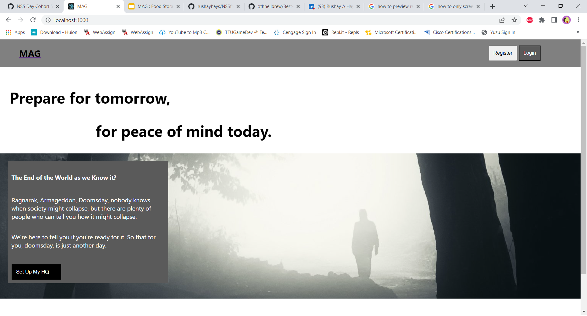

<div id="top"></div>


<h3 align="center">MAG: Food Storage</h3>

  <p align="center">
    A digital food storgae goal setter and visualizer
    </br>
    <a href="https://youtu.be/RqsOzaRovHU">View Demo</a>
  </p>
</div>


<!-- ABOUT THE PROJECT -->
## About The Project

This is an app designed to break down the process of building up food storage into small easy steps.


<p align="right">(<a href="#top">back to top</a>)</p>


### Built With

* [React.js](https://reactjs.org/)
* [HTML5](https://html.com/html5/)
* [JavaScript](https://www.javascript.com/)
* [CSS3](https://developer.mozilla.org/en-US/docs/Web/CSS)
* [react-minimal-pie-chart](https://www.npmjs.com/package/react-minimal-pie-chart)

<p align="right">(<a href="#top">back to top</a>)</p>


<!-- GETTING STARTED -->
## Getting Started

To get a local copy up and running follow these simple example steps.

### Prerequisites

This project was built on a Windows machine
The files and installs were accessed through Windows Terminal with GitBash applied to it
It was edited using Visual Studio code

My reccomendation would be to mimic that set up when working with this project

### Installation
 
1. Clone the repo
   ```sh
   git clone https://github.com/github_rushayhays/NSSfrontendCapstoneMAG.git
   ```
3. Install NPM packages
   ```sh
   npm i --save react-router-dom
   ```
   ```sh
   npm install react-minimal-pie-chart
   ```
4.I assume that cloning the repo down will automatically set it up as a react app
  If for some reason that is not the case, install this
  ```sh
  npx create-react-app
  ```
5.You will want to copy the .example database inside the api directory. When you have created the copy go ahead and remove the .example extension off of it.

<p align="right">(<a href="#top">back to top</a>)</p>


<!-- USAGE EXAMPLES -->
## Usage

Use this space to show useful examples of how a project can be used. Additional screenshots, code examples and demos work well in this space. You may also link to more resources.

The Meal Card page allows users to create meals, meals can then be added to My Food Storage


This Home Page has room to grow. Clicking on the pie chart will direct you to the Food Storage Page


Here a few different numbers are displayed, users can also compare their progress against other users


I really like the Landing Page



<p align="right">(<a href="#top">back to top</a>)</p>


<!-- CONTRIBUTING -->
## Contributing

Contributions are what make the open source community such an amazing place to learn, inspire, and create. Any contributions you make are **greatly appreciated**.

If you have a suggestion that would make this better, please fork the repo and create a pull request. You can also simply open an issue with the tag "enhancement".
Don't forget to give the project a star! Thanks again!

1. Fork the Project
2. Create your Feature Branch (`git checkout -b feature/AmazingFeature`)
3. Commit your Changes (`git commit -m 'Add some AmazingFeature'`)
4. Push to the Branch (`git push origin feature/AmazingFeature`)
5. Open a Pull Request

<p align="right">(<a href="#top">back to top</a>)</p>


<!-- CONTACT -->
## Contact

Rushay Hays - rushayhays@outlook.com

Project Link: [https://github.com/github_username/repo_name](https://github.com/github_username/repo_name)

<p align="right">(<a href="#top">back to top</a>)</p>


<!-- ACKNOWLEDGMENTS -->
## Acknowledgments

* [Brenda Long](https://github.com/brendalong)
* [Dakota Lambert](https://github.com/DakotaLambert)

<p align="right">(<a href="#top">back to top</a>)</p>


<!-- MARKDOWN LINKS & IMAGES -->
<!-- https://www.markdownguide.org/basic-syntax/#reference-style-links -->
[contributors-shield]: https://img.shields.io/github/contributors/github_username/repo_name.svg?style=for-the-badge
[contributors-url]: https://github.com/github_username/repo_name/graphs/contributors
[forks-shield]: https://img.shields.io/github/forks/github_username/repo_name.svg?style=for-the-badge
[forks-url]: https://github.com/github_username/repo_name/network/members
[stars-shield]: https://img.shields.io/github/stars/github_username/repo_name.svg?style=for-the-badge
[stars-url]: https://github.com/github_username/repo_name/stargazers
[issues-shield]: https://img.shields.io/github/issues/github_username/repo_name.svg?style=for-the-badge
[issues-url]: https://github.com/github_username/repo_name/issues
[license-shield]: https://img.shields.io/github/license/github_username/repo_name.svg?style=for-the-badge
[license-url]: https://github.com/github_username/repo_name/blob/master/LICENSE.txt
[linkedin-shield]: https://img.shields.io/badge/-LinkedIn-black.svg?style=for-the-badge&logo=linkedin&colorB=555
[linkedin-url]: https://linkedin.com/in/linkedin_username
[product-screenshot]: images/screenshot.png
